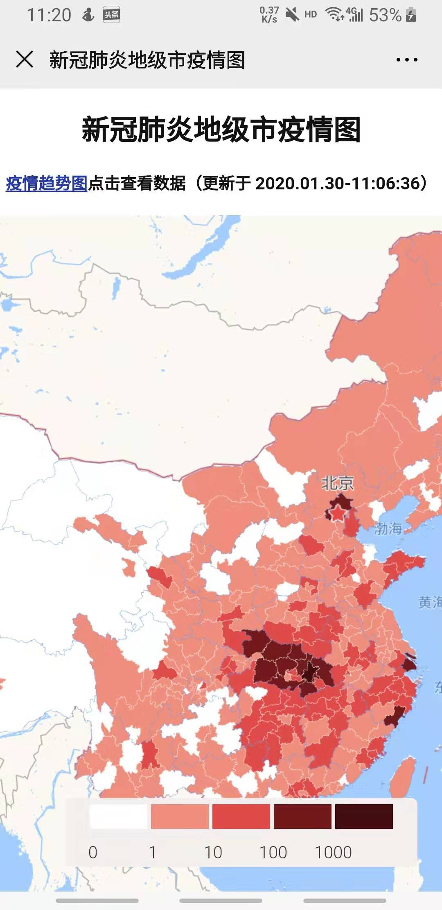

# 中国新型冠状病毒肺炎疫情地级市图

## 使用说明
### 方式一（推荐）：直接网页访问
本项目已经部署在 阿里云 上了。可以直接访问 [这里](http://etwatch.cn:8085/pneumonia/)。每十五分钟自动更新。

### 方式二：自己手动生成 

```bash
python3 generate_data.py # 这一步会从腾讯新闻疫情网页上获得地级市的疫情确认数，之后写入到 confirmed_data.js
open index.html # 使用高德地图 API 画图，使用了上一步中的获得的数据
```
##修改说明
1.增加图例
2.增加点击查看数据
3.增加趋势图页面
4.增加北京分区县疫情查看页面

## 注意事项
* 目前没有处理疑似和死亡病例
* 上海，天津不细分区县。
* 点击北京查看分区县疫情。

## 效果



